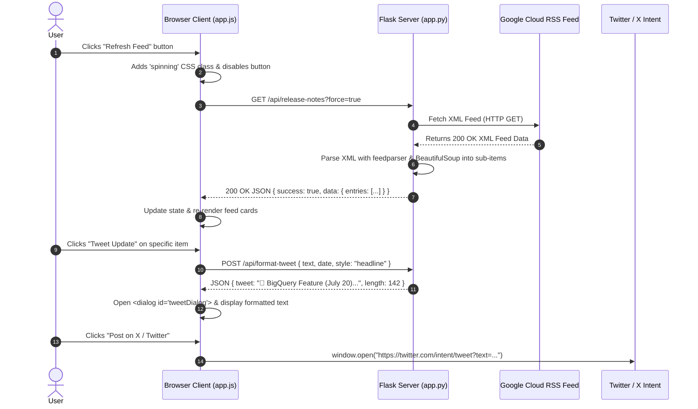

# BigQuery Pulse — Technical Architecture & Deep Dive Guide

Welcome to the detailed architecture overview for **BigQuery Pulse**, a modern web application built using Python Flask, HTML5, CSS3, and Vanilla JavaScript.

---

## 1. Main Application Features

The application provides a real-time release tracker and content studio for Google BigQuery updates:

| Feature | Description | Key Tech / APIs |
| :--- | :--- | :--- |
| **Live RSS Ingestion & Cache** | Fetches official BigQuery RSS feed, parses HTML sub-updates, and caches payload for 15 minutes. | Flask, `feedparser`, `BeautifulSoup4` |
| **Instant AJAX Refresh** | Refreshes release notes dynamically without a full browser page reload, featuring an animated SVG spinner. | Fetch API, CSS Keyframes |
| **Sub-Item Classification Engine** | Intelligently breaks down multi-item release notes into distinct categorized updates (`Feature`, `Announcement`, `Issue`). | BeautifulSoup DOM parsing |
| **Real-Time Search & Filtering** | Instant text search (`Cmd+K`) and category pills for rapid discovery. | Vanilla JavaScript Array filtering |
| **Interactive Tweet Studio** | Modal dialog to compose, style, hashtag, and share updates on Twitter/X in 1 click. | HTML5 `<dialog>`, Twitter Intent API |

---

## 2. System Architecture & Component Breakdown

The architecture is split cleanly between **Server-Side (Flask Backend)** and **Client-Side (Vanilla JS / CSS Frontend)**.

```
                    ┌─────────────────────────────────────────┐
                    │      Google Cloud RSS Feed Source       │
                    │ (docs.cloud.google.google/bigquery.xml) │
                    └────────────────────┬────────────────────┘
                                         │ (HTTP XML)
                                         ▼
┌─────────────────────────────────────────────────────────────────────────────────┐
│                              FLASK SERVER (app.py)                              │
│                                                                                 │
│   ┌──────────────────────┐    ┌─────────────────────┐    ┌──────────────────┐   │
│   │ Cache Controller     │───>│ Feed Parser Engine  │───>│ Tweet Formatter  │   │
│   │ (15m TTL / Force)    │    │ (BeautifulSoup HTML)│    │ API Engine       │   │
│   └──────────────────────┘    └─────────────────────┘    └──────────────────┘   │
└────────────────────────────────────────┬────────────────────────────────────────┘
                                         │ (JSON API / HTML)
                                         ▼
┌─────────────────────────────────────────────────────────────────────────────────┐
│                             CLIENT SIDE (Browser)                               │
│                                                                                 │
│  ┌───────────────────────┐   ┌────────────────────────┐   ┌──────────────────┐  │
│  │ View Layer            │   │ App State Controller   │   │ Tweet Studio     │  │
│  │ (index.html/style.css)│<──│ (static/js/app.js)     │──>│ Native <dialog>  │  │
│  └───────────────────────┘   └────────────────────────┘   └──────────────────┘  │
└────────────────────────────────────────┴────────────────────────────────────────┘
```

### A. Server-Side Architecture (`app.py`)

1. **Feed Fetcher & Parser (`fetch_and_parse_feed`)**:
   - Downloads XML content from `https://docs.cloud.google.com/feeds/bigquery-release-notes.xml` (with fallback to `https://cloud.google.com/feeds/bigquery-release-notes.xml`).
   - Uses `feedparser` to extract entries and dates.
   - Uses `BeautifulSoup` to iterate through HTML nodes inside each entry, splitting headers (`<h3>Feature</h3>`, `<h3>Announcement</h3>`) into individual sub-note items.
   - Extracts anchor tags (`<a href="...">`) to build clean link metadata.

2. **Endpoints**:
   - `GET /`: Renders `templates/index.html`.
   - `GET /api/release-notes?force=true`: Returns structured JSON containing all entries, sub-items, metadata, and timestamps.
   - `POST /api/format-tweet`: Accepts an update text snippet, style choice (`standard`, `headline`, `breakdown`, `tldr`), and constructs a formatted tweet.

### B. Client-Side Architecture (`static/js/app.js`, `static/css/style.css`, `templates/index.html`)

1. **State Management (`state` object)**:
   - Holds raw `entries`, `flattenedItems` array, current `activeFilter`, `searchQuery`, and `currentSelectedItem`.

2. **Dynamic UI Renderer (`renderFeed`)**:
   - Groups filtered items by date header.
   - Renders timeline cards with type badges (`badge-feature`, `badge-announcement`, `badge-issue`).
   - Binds click listeners to trigger Tweet Studio modal.

3. **Tweet Studio (`<dialog id="tweetDialog">`)**:
   - Uses native HTML5 `<dialog>` modal with backdrop blur.
   - Calculates 280-character Twitter limits with dynamic color warning bars.
   - Triggers `window.open('https://twitter.com/intent/tweet?text=...')`.

---

## 3. End-to-End Sample Request & Response Flow

Here is a step-by-step trace of what happens when a user clicks **"Refresh Feed"** and then **"Tweet Update"**:

### Flow Diagram (Sequence)



---

## 4. Codebase Sitemap & Quick Links

All application source code is available in your workspace:

- 🐍 **Flask Application**: [`app.py`](file:///Users/acharya/Documents/Vibe%20Coding%20Course%20With%20Google/bq-releases-notes/app.py)
- 🎨 **HTML Template**: [`templates/index.html`](file:///Users/acharya/Documents/Vibe%20Coding%20Course%20With%20Google/bq-releases-notes/templates/index.html)
- 💅 **CSS Stylesheet**: [`static/css/style.css`](file:///Users/acharya/Documents/Vibe%20Coding%20Course%20With%20Google/bq-releases-notes/static/css/style.css)
- ⚡ **Client JavaScript**: [`static/js/app.js`](file:///Users/acharya/Documents/Vibe%20Coding%20Course%20With%20Google/bq-releases-notes/static/js/app.js)
- 🚀 **Runner Script**: [`start.sh`](file:///Users/acharya/Documents/Vibe%20Coding%20Course%20With%20Google/bq-releases-notes/start.sh)
- 📄 **Project Architecture**: [`ARCHITECTURE.md`](file:///Users/acharya/Documents/Vibe%20Coding%20Course%20With%20Google/bq-releases-notes/ARCHITECTURE.md)
